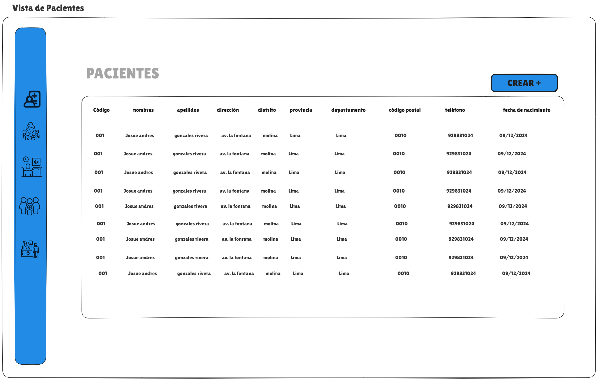
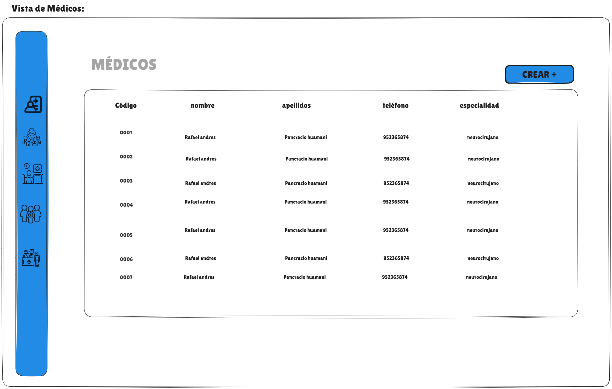
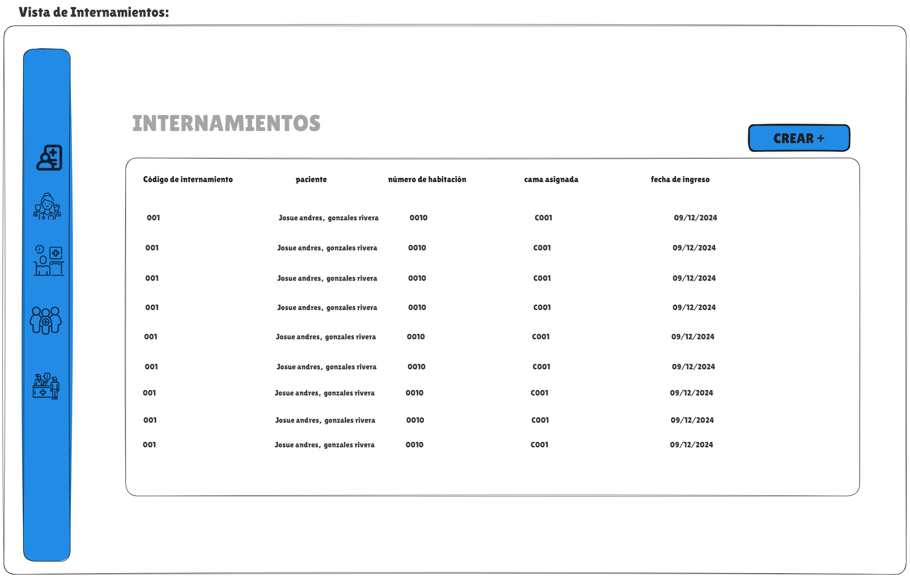
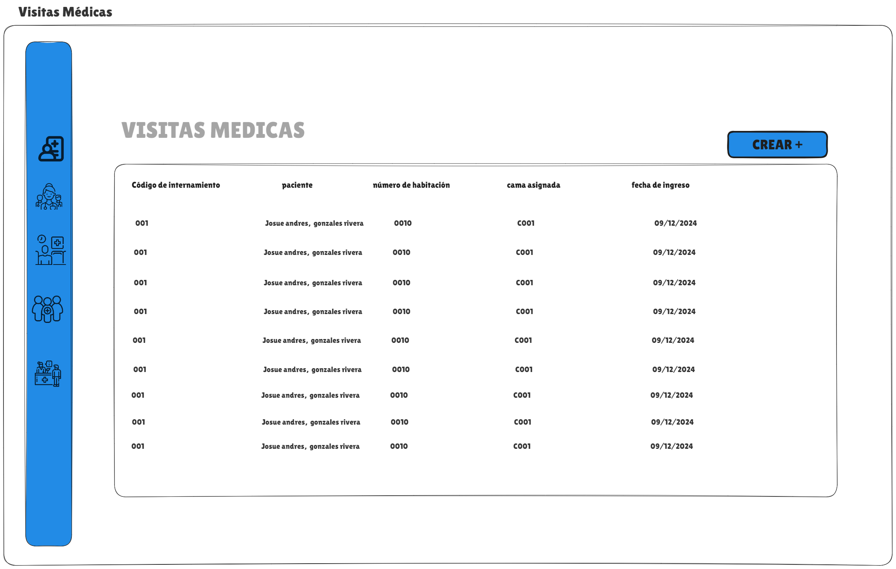

# MediCita - Plataforma Web para la Administración de Citas Médicas

 

**MediCita** es una plataforma web diseñada para la administración de citas médicas en un hospital. Desarrollada con **Vue.js** y **Vuetify**, esta aplicación proporciona una interfaz moderna y eficiente para gestionar citas, pacientes, médicos, internamientos y visitas médicas.


## Instalar todas las dependencias
```
npm install
```

### Comando para arrancar el proyecto de manera local
```
vue serve 
```

### Compando para generar el dist y desplegarlo en producción 
```
npm run build
```


### Customize configuration
See [Configuration Reference](https://cli.vuejs.org/config/).


# VISTAS DEL PROYECTO 
### vista login


### vista pacientes


### vista Medicos


### vista Internamientos


### vista Visitas medicas



